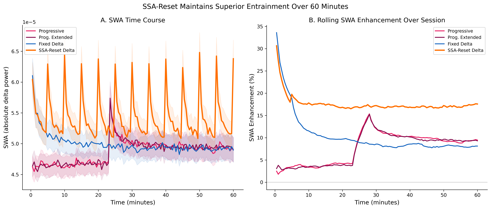
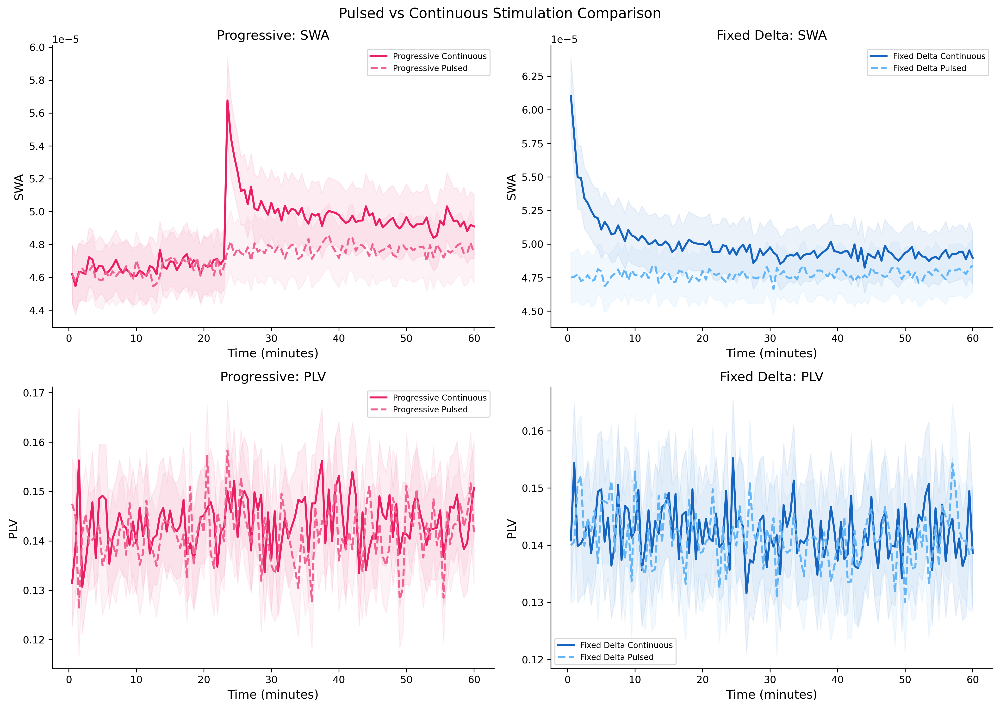
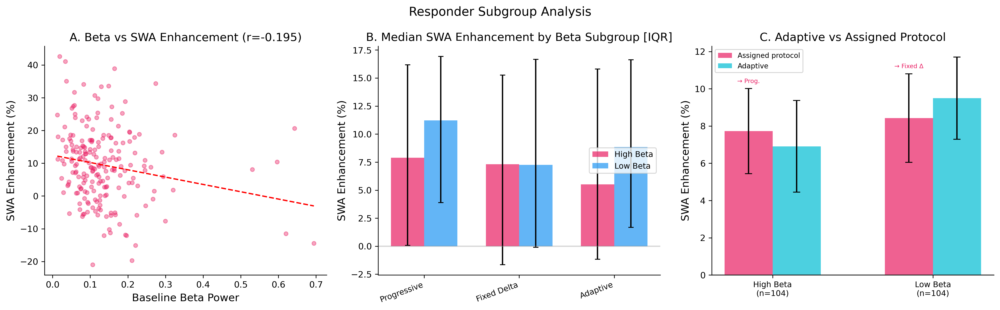
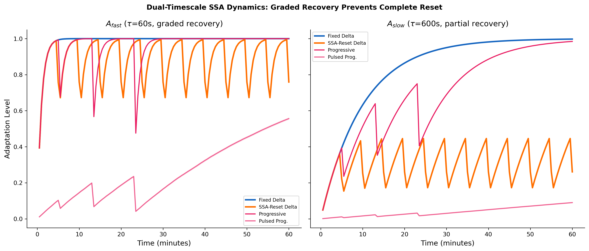
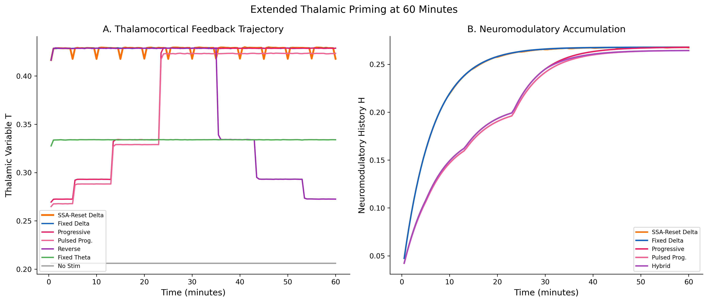
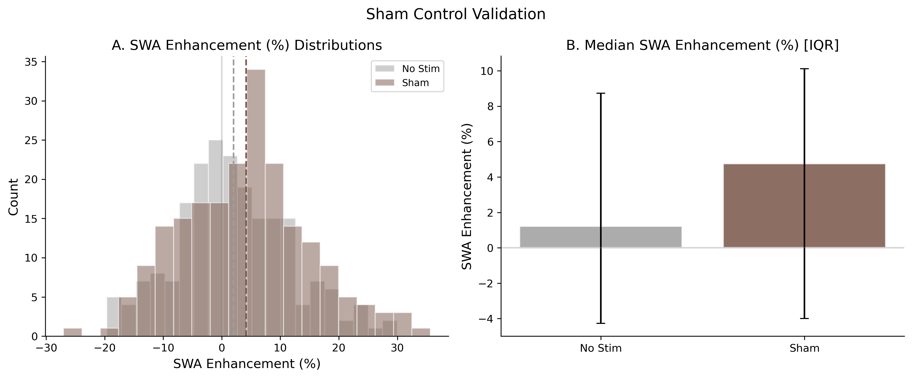

# Stimulus-Specific Adaptation Reset Enhances Simulated Auditory Sleep Entrainment

A computational study using a Thalamocortical Stuart-Landau Ensemble (TSLE) model to evaluate 16 auditory entrainment protocols across 208 polysomnography subjects from 5 international sleep databases.

## Key Findings

- **SSA-reset protocols** (periodic 1 Hz frequency wobbles during fixed-delta stimulation) produce the largest sleep depth enhancement, with the slow-tau variant (tau_slow = 1200 s) achieving mean SDRE = 1.35
- **Hierarchical sham controls** confirm dose-response ordering: no stimulation (0.03) < sub-threshold sham (0.98) < active stimulation (1.06)
- **Pulsed (SO phase-locked) delivery** reduces efficacy compared to continuous stimulation
- **SSA sensitivity analysis** shows adaptation time constant modulates efficacy (tau_slow 300 s: 1.29, 600 s: 1.29, 1200 s: 1.35)
- **Baseline beta power** predicts individual entrainment response (high beta = lower SDRE)

## Study Design

**16 conditions x 208 subjects x 60 min** within-subject repeated-measures design:

| Condition | Description | Mean SDRE |
|-----------|-------------|:---------:|
| SSA-Reset Slow | Fixed delta + SSA resets (tau_slow = 1200 s) | 1.35 |
| SSA-Reset Delta | Fixed delta + 1 Hz wobbles every 5 min | 1.29 |
| SSA-Reset Fast | Fixed delta + SSA resets (tau_slow = 300 s) | 1.29 |
| Prog. Extended | Progressive + extended delta tail | 1.11 |
| Progressive | 10 -> 8.5 -> 6 -> 2 Hz descent | 1.10 |
| Adaptive | Beta-guided protocol selection | 1.09 |
| Fixed Delta | 2 Hz throughout | 1.06 |
| Pulsed Delta | SO phase-locked 2 Hz | 1.02 |
| Pulsed Prog. | SO phase-locked progressive | 1.01 |
| Sham | Sub-threshold (2 Hz, F = 0.02, 20% amplitude) | 0.98 |
| Prog. Hybrid | Continuous -> pulsed transition | 0.95 |
| Active Sham | Random freq per epoch, full amplitude | 0.56 |
| Fixed Theta | 6 Hz throughout | 0.53 |
| Fixed Alpha | 8.5 Hz throughout | 0.32 |
| Reverse | 2 -> 6 -> 8.5 -> 10 Hz | 0.20 |
| No Stimulation | F = 0 | 0.03 |

## Figures

**Fig 1. Adaptation time course and crossover hypothesis**


**Fig 2. Pulsed vs. continuous stimulation comparison**


**Fig 3. Responder subgroup analysis**


**Fig 4. Dual-timescale SSA dynamics across conditions**


**Fig 5. Extended thalamic priming at 60 min**


**Fig 6. Hierarchical sham validation**


## Model: Thalamocortical Stuart-Landau Ensemble (TSLE)

The TSLE extends the Kuramoto phase-oscillator model with:

- **Stuart-Landau oscillators** (N = 64): amplitude dynamics + frequency-selective resonance
- **Thalamocortical feedback loop**: fast variable T (tau = 10 s) drives frequency shift; slow variable H (tau = 600 s) drives excitability boost
- **Stimulus-specific adaptation (SSA)**: sustained forcing reduces response (tau = 600 s, max 60% reduction); resets on frequency change

Cortical ensemble equation:

```
dz_i/dt = (lambda_i(t) + i*omega_i(t))z_i - |z_i|^2 z_i + K(z_bar - z_i) + F_eff * e^{i*Omega*t} + sigma * dW_i
```

## Reproduction

### Prerequisites

```bash
pip install -r requirements.txt
```

### Run the 16-condition study

```bash
# Full pipeline (208 subjects x 16 conditions x 60 min)
python scripts/run_redesigned_study.py --workers 6 --duration 60

# Quick test (20 subjects)
python scripts/run_redesigned_study.py --workers 6 --duration 60 --n-subjects 20
```

### Generate figures

```bash
python -m analysis.redesigned_figures
```

## Project Structure

```
├── analysis/
│   ├── thalamocortical_model.py    # Core TSLE model
│   ├── kuramoto_entrainment.py     # Comparison Kuramoto model
│   ├── protocol_comparison.py      # Protocol definitions + metrics
│   ├── redesigned_protocols.py     # 16-condition protocol definitions
│   ├── statistical_validation.py   # Friedman, Wilcoxon, FDR, effect sizes
│   ├── redesigned_figures.py       # 6 publication figures
│   ├── figures.py                  # Additional figures
│   ├── eeg_processing.py           # EDF parsing + band power extraction
│   └── *_processing.py             # Per-database data processors
├── scripts/
│   ├── run_redesigned_study.py     # Main 16-condition pipeline
│   ├── run_protocol_study.py       # 7-condition study
│   ├── run_frequency_scan.py       # Frequency-response mapping
│   └── run_tsle_sensitivity.py     # Parameter sensitivity analysis
├── results/
│   └── redesigned_study/           # 16-condition study results
│       ├── session_metrics.csv     # Session-level metrics (N = 3,328)
│       ├── statistics/             # Statistical reports (JSON)
│       ├── figures/                # Figures (PDF + PNG)
│       ├── verification.json       # Simulation integrity checks
│       ├── cross_validation.json   # Discovery/validation split
│       └── responder_subgroups.json
├── requirements.txt
└── .gitignore
```

## Data Sources

Subject EEG data are publicly available from the following repositories:

| Database | N | Source | URL |
|----------|---|--------|-----|
| Sleep-EDF | 153 | PhysioNet | https://physionet.org/content/sleep-edfx/1.0.0/ |
| CAP Sleep | 15 | PhysioNet | https://physionet.org/content/capslpdb/1.0.0/ |
| DREAMS | 5 | Univ. de Mons | https://zenodo.org/records/2650142 |
| HMC | 11 | PhysioNet | https://physionet.org/content/hmc-sleep-staging/1.1/ |
| SLPDB | 18 | PhysioNet | https://physionet.org/content/slpdb/1.0.0/ |
| Other | 6 | ANPHY, EPCTL | See manuscript |

To download and process the raw EEG data:

```bash
# Download Sleep-EDF (largest database)
bash scripts/download_sleep_edf.sh

# Process all recordings into band power CSVs
python analysis/eeg_processing.py data/raw/sleep-edfx/1.0.0/sleep-cassette
```

Processed data (band powers per 30 s epoch) can be regenerated from the raw EDF files using the processing pipeline above.

## License

MIT License

## Citation

If you use this code or model in your research, please cite this repository.
